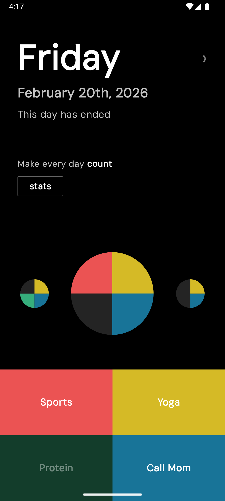
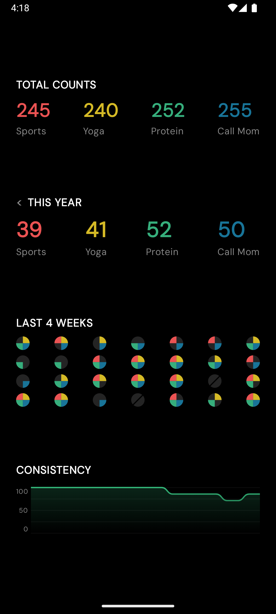

<!-- Replace with your banner image: -->
<!--  -->

# No Zero Days

**A minimal habit tracker for Android**

<!-- Replace with your Play Store badge once published: -->
<!--  -->

*Play Store link coming soon*

---

## About

No Zero Days is a distraction-free habit tracker built around one idea: **don't let a day be a zero**.

Inspired by the [No Zero Days philosophy](https://www.reddit.com/r/NonZeroDay/comments/1qbxvz/), the app encourages you to do at least something toward each of your habits every single day — no matter how small. There are no streaks to obsess over, no notifications demanding your attention, and no social features competing for your focus. Just four habits, a clean interface, and a record of your effort.

---

## How to Use

- **Toggle a habit** — Tap one of the four colored buttons to mark that habit as done for the day.
- **Rename a habit** — Long-press any habit button to edit its label. Tap the button or press Done to save. Names persist across app restarts.
- **Browse past days** — Swipe the timeline circles left to scroll back through your history. You can view and edit habit completions for any past day.
- **Jump back to today** — While viewing a past day, tap the day/date text in the header to instantly scroll back to today.
- **View your stats** — Tap the **Stats** button to open the stats screen. Swipe up to dismiss it. The stats screen shows:
  - **Total Counts** — how many times each habit has been completed across all recorded history.
  - **Last 4 Weeks** — a 4×7 grid of quadrant circles giving a visual overview of the past 28 days.
  - **Consistency** — a rolling 10-day average graph showing how often you completed at least one habit, plotted over the last ~30 data points.
  - **This Year** — habit counts for the current calendar year. Swipe right to browse previous years.

---

## Screenshots

| Main Screen | Stats Screen |
|---|---|
|  |  |

---

  Built with Jetpack Compose · Room · MVVM

